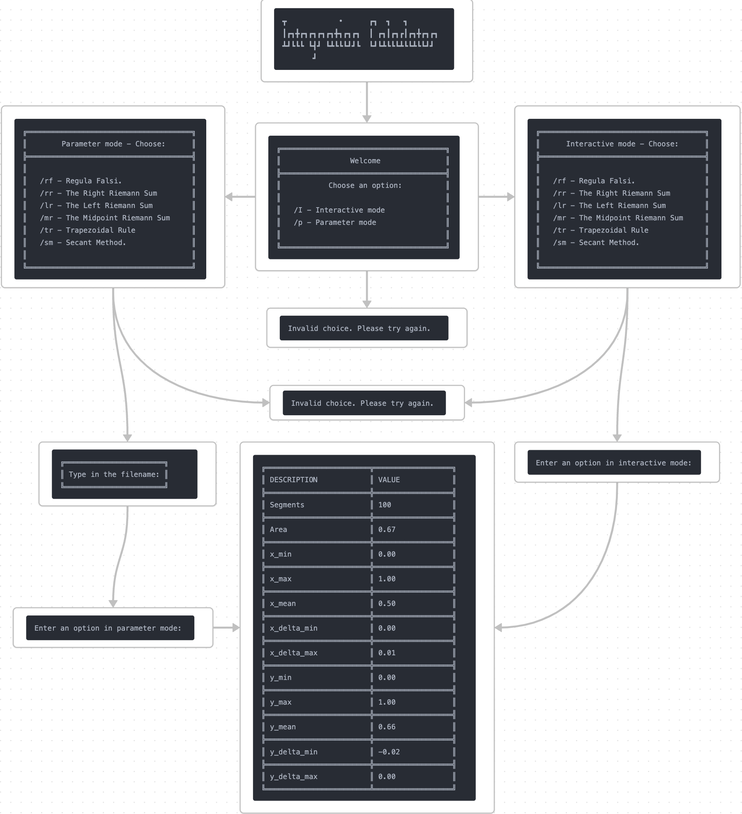

# Integration Calculator: Developer Documentation

## Table of Contents
- [Project Overview](#project-overview)
- [System Requirements](#system-requirements)
- [Installation Guide](#installation-guide)
- [Codebase Structure](#codebase-structure)
- [Module Descriptions](#module-descriptions)
- [Flow Diagrams](#flow-diagrams)
- [API Documentation](#api-documentation)
- [Developer Notes](#developer-notes)
- [Troubleshooting Guide](#troubleshooting-guide)
- [Change Log](#change-log)
- [Testing Documentation](#testing-documentation)
    - [Testing Scope](#testing-scope)
    - [Test Environment](#test-environment)
    - [Test Cases](#test-cases)
    - [Test Data](#test-data)
    - [Bug Reports](#bug-reports)

## Project Overview
The **Integration Calculator** is a menu-driven C program that allows users to perform numerical integration on user-defined functions. It supports different integration methods such as **Regula Falsi**, **Right Riemann Sum**, **Left Riemann Sum**, **Midpoint Riemann Sum**, **Trapezoidal Rule**, and **Secant Method**. The program is designed to handle polynomials, common mathematical functions, and their combinations.

## System Requirements
- **Operating System**: Linux, macOS, or Windows with a C compiler.
- **Compiler**: GCC, Clang, or other C99 compatible compilers.
- **Dependencies**:
    - CMake (for building the project).
    - Standard C libraries (`stdio.h`, `stdlib.h`, `string.h`, `math.h`).

## Installation Guide
1. **Clone the Repository**:
    ```bash
    git clone https://github.com/yourusername/integration-calculator.git
    ```
2. **Build the Project**:
    ```bash
    cd integration-calculator
    mkdir build && cd build
    cmake ..
    make
    ```
3. **Run the Program**:
    ```bash
    ./Integration_Calculator
    ```

## Codebase Structure
- `src/` - Contains the source code files.
- `include/` - Contains header files for function declarations and data structures.
- `assets/` - Contains banner images used in the `README.md`.
- `CMakeLists.txt` - CMake build configuration.
- `README.md` - General information about the project.

## Module Descriptions
### `main.c`
- Entry point of the program.
- Initializes the menu and calls the `userInterface()` function.

### `menu_manager.c`
- Manages the interaction menus (interactive and parameter mode).
- Handles user inputs and directs to appropriate functionality.

### `integration.c`
- Implements different numerical integration techniques (e.g., `regulaFalsi()`, `rightRiemannSum()`).

### `user_input.c`
- Handles user input for function parameters, including parsing expressions.

### `parser.c`
- Parses mathematical functions into an abstract syntax tree (AST).
- Provides evaluation for parsed functions.

## Flow Diagrams
The diagram below describes the flow of control in the **Interactive Mode**:




## API Documentation
### `double regulaFalsi(Node* root, double a, double b, double tol)`
- **Description**: Finds the root of a function using the Regula Falsi method.
- **Parameters**:
    - `root`: Root of the parse tree representing the function.
    - `a`, `b`: Interval bounds.
    - `tol`: Tolerance level for root approximation.

### `double evaluate(const Node* root, double x)`
- **Description**: Evaluates the function represented by a parse tree at a given `x` value.

## Developer Notes
- All menu banners are stored in `assets/` for easy replacement.
- The `parser.c` uses recursive functions; ensure sufficient stack size for complex expressions.

## Troubleshooting Guide
- **File Not Found**: Ensure `input.csv` is present in the correct directory.
- **Segmentation Fault**: Usually caused by incorrect parsing of expressions; check syntax carefully.

## Change Log
- **v1.0**: Initial release with interactive and parameter modes.
- **v1.1**: Added support for logarithmic functions and improved error handling.

## Testing Documentation
### Testing Scope
- Verify all integration methods work correctly for both **interactive** and **parameter** modes.
- Ensure proper error handling for invalid inputs.
- Verify that menu interactions follow the expected flow.

### Test Environment
- **Operating System**: Ubuntu 20.04, macOS 12.0
- **Compiler**: GCC 9.3, Clang 12.0

### Test Cases
1. **Test Case 1**: Regula Falsi with `sin(x)` between `a=0` and `b=π`.
    - **Steps**: Start program -> Select **Interactive Mode** -> Enter `/rf` -> Input function `sin(x)` -> Input interval `0` and `π`.
    - **Expected Result**: Should return a root close to `π`.

2. **Test Case 2**: Midpoint Riemann Sum with `x^2` between `a=0` and `b=2`.
    - **Steps**: Start program -> Select **Parameter Mode** -> Enter `/mr` -> Input function `x^2` -> Input interval `0` and `2`.
    - **Expected Result**: Should output `2.67` as the approximate integral value.

3. **Test Case 3**: Handling invalid input.
    - **Steps**: Start program -> Select **Interactive Mode** -> Enter `/rf` -> Input `abc` as function.
    - **Expected Result**: Error message "Invalid function input."

### Test Data
- **Input Functions**:
    - `sin(x)`, `cos(x)`, `log(x)`, `x^3 + 2*x - 5`
- **Intervals**:
    - `[0, 1]`, `[-1, 2]`, `[1, 5]`
- **Expected Outputs**:
    - Ensure each function’s output matches calculated values from verified tools (e.g., WolframAlpha).

### Bug Reports
1. **Bug ID**: `#001`
    - **Issue**: Program crashes when entering a variable not in `x` (e.g., `y`).
    - **Steps to Reproduce**: Enter a function involving `y` as the variable.
    - **Severity**: High
    - **Resolution**: Added check to limit variable input to `x`.

2. **Bug ID**: `#002`
    - **Issue**: Incorrect output for negative values in `log(x)`.
    - **Steps to Reproduce**: Enter `log(x)` with `a=-1` and `b=1`.
    - **Severity**: Medium
    - **Resolution**: Added validation to ensure `x > 0` for `log(x)`.

---
This documentation aims to provide developers with the information needed to maintain and expand the **Integration Calculator** effectively, and to help testers ensure the software functions as intended across all specified scenarios.

